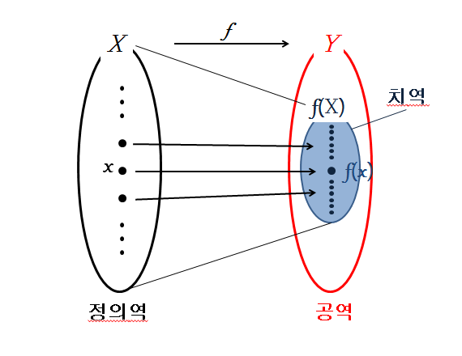

타원 곡선(Elliptic Curve) 유한체상 연산에서 정의되는 이산대수 문제의 어려움에 기반한 공개키 암호 방식입니다.
줄여서 **ECC**(Elliptic-curve cryptography)라고 쓰기도 합니다.
1985년에 닐 코블리츠(Neal Koblitz)와 빅터 밀러(Victor Miller)가 각각 독립적으로 제안했습니다.
아직까지 해독 방법은 발견되지 않았습니다.

기본 공개키 암호 방식(RSA/DSA/Rabin/ElGamal)에 비하여 갖는 장점은 짧은 키 길이와 빠른 연산속도를 가지면서 동일한 수준의 보안 강도를 제공합니다.
예를 들어 256bit 타원 곡선 공개키는 3072bit RSA 공개키와 유사한 보안 강도를 제공합니다.

.NIST Recommended Key Sizes
[cols="1,1,1"]
|===
|Symeetric Key Size(bits)|RAS and Diffie-Hellman Key Size(bits)|Elliptic Curve Key Size(bits)

|80|1024|160
|112|2048|224
|128|3072|256
|182|7680|384
|256|15360|521
|===
ECC는 EC(Elliptic Curve, 타원 곡선)를 사용한 암호기술의 총제적인 이름이며, 실제로 적용된 분야와 알고리즘 이름은 아래와 같다.

1. **디지털서명: ECDSA**(Elliptic Curve Digital Signature Algorithm)
2. **키교환: ECDH**(Elliptic-curve Diffie–Hellman)
3. **난수 생성: Dual_EC_DRBG**(Dual Elliptic Curve Deterministic Random Bit Generator) +
kleptographic backdoor 문제로 이슈가 되었고, 더 이상 사용되지 않는다고 함 : 미국 국가안보국(NSA, National Security Agency)에서 고의로 백도어를 넣었다는 주장이 제기됨)
4. **Encryption & Decryption** : **EC-KEM, EC ELGamal, Massey-Omura, Menezes Vanstone**과 같은 알고리즘이 소개 되었으나, 보편적으로 알려진 이름은 없습니다.

타원곡선암호는 link:https://ko.wikipedia.org/wiki/%EC%9C%A0%ED%95%9C%EC%B2%B4[유한체] 상의 타원곡선(Elliptic Curve over Finite Field)의 수학적 성질을 이용합니다.
유한체 위에서 타원곡선의 대수적 구조를 기반으로 한 이산로그 문제에 착안해서 만들어졌습니다.

====
**정의역(domain), 공역(codomain), 치역(range)**

X에서 Y로의 함수인 latexmath:[f:X \to Y] 는 두개의 집합을 필요로 합니다. +
시작점인 집합 X는 정의역(domain)이라 부르며, +
끝점인 집합 Y는 공역(codomain)이라고 부릅니다.

정의역인 X의 원소 중 하나를 latexmath:[x]라고 하고, +
함수 latexmath:[f]에 의해 latexmath:[x]와 관계되어지는 공역인 Y의 원소를 latexmath:[y]라고 할 때, +
이 사실을 간단하게 latexmath:[y = f(x)]라고 표현합니다.

이때 latexmath:[y]를 latexmath:[x]의 상(Image)라고 부르며, +
latexmath:[x]는 latexmath:[y]의 원상(preimage)라고 부릅니다. +
여기서 집합 X에 속한 모든 원소들의 상(image)의 집합을 치역(range)라고 부릅니다.

치역은 공역의 부분집합니다.
====

### 유한체(Finite Field)
"집합에 속해 있는 원소의 수가 한정되어 있으며, 덧셈, 곱셈 연산에 대하여 닫혀 있는 집합"을 의미합니다.
"닫혀 있다" 란, 연산의 결과 값도 집합에 속해있다는 것을 의미합니다.
암호학에서는 그래프와 부딪히는 값을 추측하지 못하도록 더 어렵게 하기 위해, 정의역과 치역을 소수 latexmath:[p] 체계로 한정합니다.
또한 연산의 결과 값에 대해 특정 수(암호학에선 prime number 사용) latexmath:[p] 를 가지고 latexmath:[mod] 연산을 합니다.
유한체를 사용하는 이유는, 암호연산은 정수를 기반으로 계산해야 하기 때문이라고 합니다.
참고로, 타원곡선이 암호학에 적합한 이유는, 실수(Real Number)상에서 연산을 하든, 유한체 상에서 연산을 하든, 동일한 수학법칙이 적용되기 때문입니다.

원소의 개수가 latexmath:[p] 인 유한체 latexmath:[\mathbb{F}]는 "latexmath:[\mathbb{F}_p] 또는 latexmath:[G\mathbb{F}(p)]"로 표시하며,
각 원소는 "0,1,2, ... ,(p-1)" 중의 하나가 됩니다.
"유한체 상에서 정의된 타원곡선"은 latexmath:[E(\mathbb{F}_p)]로 표시합니다.

====
**latexmath:[mod] 연산** +
나눗셈을 하여 나머지를 구하는 연산입니다.
Modular 연산이라고도 부르면, "latexmath:[y = x\bmod n]" 로 표시합니다.
latexmath:[n]을 modulus라고 부릅니다(ECC에선 n 값이 소수(prime)이기 때문에 latexmath:[n] 대신 p 기호를 사용).
====

암호학에서 주로 사용하는 유한체는 Prime(소수) Field와 Binary Field 2가지 입니다.
여기서는 비트코인과 이더리움이 사용하고 있는 Prime Field만 정리합니다.
Prime Field란, 원소의 개수인 latexmath:[p]가 소수(Prime) 임을 의미합니다
(참고로, Binary Field는 원소의 개수가 2^m^ 임을 의미합니다. m-bit string으로 표시됩니다).

ECC를 사용하는 자들은, 타원곡선을 정의하는 Parameter인 "Domain Parameter"를 공유해야 합니다.
Prime Field 에서는 Domain Parameter는 latexmath:[(p,a,b,G,n,h)]로 구성됩니다.
Domain Parameter를 만드는 작업은 시간이 많이 소요되고 까다로운 Curve 상의 Point 연산이므로,
여러 표준 단체에서 각 Field Size에 맞는 타원곡선에 대한 Domain Parameter를 발표 하였습니다.
이것은 "Standard Curve" 또는 "Named Curve"라고 부릅니다.
따라서 EC의 Domain Parameter는 valuelatexmath:[(p,a,b,G,n,h)]나 name(p-256 or secp256k1)으로 표시되어집니다.

* latexmath:[p] : Modulo Prime Number
* latexmath:[a] : 타원곡선 방정식에서 사용되는 계수
* latexmath:[b] : 타원곡선 방정식에서 사용되는 계수
* latexmath:[G] : Base point 또는 Generator Point, latexmath:[G]는 latexmath:[E(\mathbb{F}_p)]에 속해 있는 point 입니다.
* latexmath:[n] : the order of point latexmath:[G](G를 n번 더하면, 무한원점이 되는 값 : latexmath:[nG = \infty])
* latexmath:[h] : cofactor

link:https://nvlpubs.nist.gov/nistpubs/FIPS/NIST.FIPS.186-4.pdf[FIPS 186-4] 및 link:https://www.secg.org/sec2-v2.pdf[SEC2 v2.0] 에서는 5개의 Prime Field를 recommend하고 있는데,
latexmath:[p] size가 192bit , 224bit , 256bit , 384bit , 521bit인 5개입니다.
각 Prime Field에 대하여 하나의 타원곡선을 recommend 하고 있습니다.

### 타원 곡선(Elliptic Curve)

## Reference
* link:https://www.secg.org/[Standards for Efficient Cryptography Group]
** link:https://www.secg.org/sec1-v2.pdf[SEC 1: Elliptic Curve Cryptography, Version 2.0]
** link:https://www.secg.org/sec2-v2.pdf[SEC 2: Recommended Elliptic Curve Domain Parameteres, Version 2.0]
* link:https://nvlpubs.nist.gov/nistpubs/FIPS/NIST.FIPS.186-4.pdf[NIST: FIPS PUB 186-4: Digital Signature Standard (DSS)]
* link:https://m.blog.naver.com/aepkoreanet/221178375642[AEP코리아네트 - 비트코인에서 사용하는 타원곡선암호기술(ECC)]
* link:https://developer-mac.tistory.com/83[나를위한노트 - 기초 암호학(4) - ECC(타원곡선 암호화 알고리즘)]
* link:https://www.crocus.co.kr/1226[Crocus-타원 곡선 암호학(Elliptic Curve Cryptography)]
* link:https://itwiki.kr/w/%ED%83%80%EC%9B%90_%EA%B3%A1%EC%84%A0_%EC%95%94%ED%98%B8[IT위키 - 타원 곡선 암호]
* link:http://cryptostudy.xyz/crypto/article/3-ECC-%ED%83%80%EC%9B%90%EA%B3%A1%EC%84%A0%EC%95%94%ED%98%B8[Crypto 스터디 - Elliptic curve cryptography 개요]
* link:https://medium.com/humanscape-tech/blockchain-elliptic-curve-cryptography-ecc-49e6d7d9a50a[휴먼스케이프 기술 블로그 - [Blockchain\] Elliptic Curve Cryptography(ECC)]
* link:https://medium.com/@blairlmarshall/how-does-ecdsa-work-in-bitcoin-7819d201a3ec[How does ECDSA work in Bitcoin]
* 정의역(domain), 공역(codomain), 치역(range)
** link:https://m.blog.naver.com/mathclass1/221967869896[mathclass1 - 정의역, 공역, 치역]
** link:https://m.blog.naver.com/obrigadu/50100037502[obrigadu - 정의역(Doamin), 치역(Range), 공역(Codomain)]
