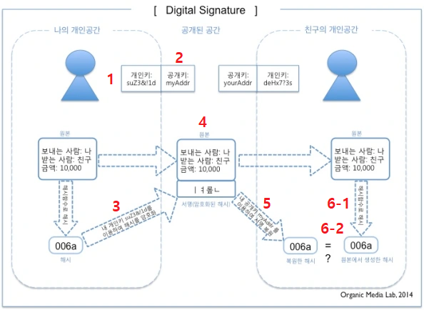

트랜잭션(거래)을 발생시킨 사람의 정당성을 보증하거나 거래ㆍ블록체인 변조 방지, 암호화 등 보안과 관련된 기능이다.

전자 서명은 전자 데이터의 타당성을 증명하는 것이다. 전자 데이터를 보내는 사람이 서명을 생성하고 받는 사람은 그 서명을 검증해 타인에 의한 위조나 변조가 이루어졌는지를 확인할 수 있다.

기술측면에서 전자서명이란 전자문서의 해시(HASH)값을 서명자의 개인키(전자서명생성정보)로 변환(암호화)한 것으로서 RSA사에서 만든 PKCS#7 의 표준이 널리 사용되고 있다.

## 전자 서명의 생성ㆍ검증의 흐름

1. 보내는 사람은 '비밀키(suZ3&!1d)'와 '공개키(myAddr)'로 구성된 키 쌍을 생성한다. 비밀키는 서명 생성 용도의 키, 공개키는 서명 검증 용도의 키다.
2. 보내는 사람은 ①에서 만든 공개키를 미리 받는 사람에게 전달한다.
3. 보내는 사람은 ①에서 만든 비밀키를 이용해 전자 데이터의 해시(006a)를 암호화 한다. 암호화로 만들어진 암호문(ㅣㅕ릎ㄴ)을 '전자 서명'이라고 한다.
4. 보내는 사람은 ③에서 생성한 전자 서명을 전자 데이터에 붙여 받는 사람에게 전달한다.
5. 받는 사람은 ②에서 받은 공개 키를 이용해 ④에서 받은 전자 서명을 복호화한다. 복호화하면 원본 전자 데이터의 해시가 생성된다.
6. 받는 사람은 ④에서 받은 전자 데이터의 해시와 ⑤에서 복호화한 결과를 비교해 내용이 같은지 확인한다. 비교 결과가 같다면 전자 데이터는 위조나 변조되지 않은 것이다.

전자 서명은 공개키 암호화 방식의 구조를 응용한 것이다.
전자 서명은 공개키 암호화 방식에서 사용되는 키 쌍이 가진 다음과 같은 특성을 이용하고 있다.

* 비밀키로 암호화한 것은 공개키로 복호화할 수 있음 (반대로 공개키로 암호화한 것은 비밀키로 복호화 가능)
* 비밀키는 다른 사람에게 공개하지 않음
* 공개키는 다른 사람에게 공개

## SECP-256k1

## Reference

* link:https://ko.wikipedia.org/wiki/%EC%A0%84%EC%9E%90%EC%84%9C%EB%AA%85[위키백과 - 전자서명]
* link:https://www.ams.org/journals/mcom/1987-48-177/S0025-5718-1987-0866109-5/S0025-5718-1987-0866109-5.pdf[Elliptic Curve Cryptosystems by Neal Koblitz]

