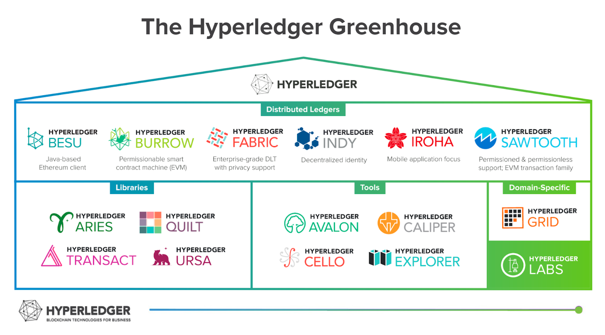
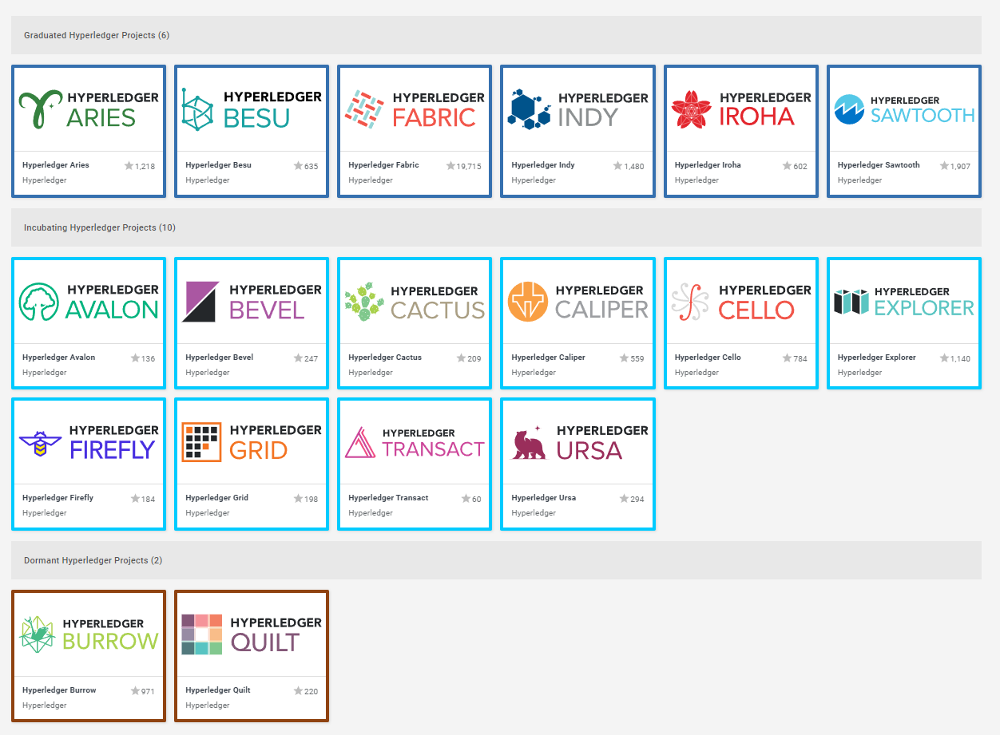
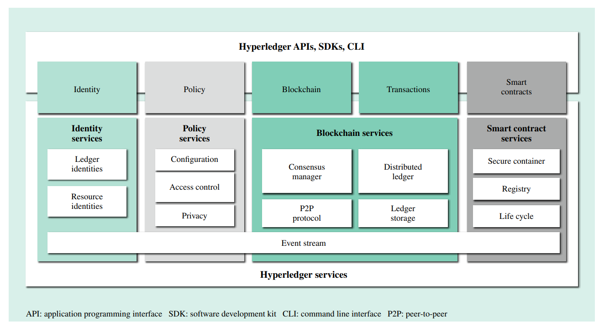
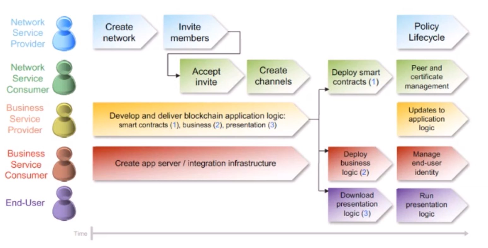

## Decentralize (개인생각)
* General: evenryone
* Enterprise: not one

## Hyperledger Project

엔터프라이즈 블록체인 에코시스템, link:https://www.hyperledger.org/learn/white-papers[White Papers] +
Building enterprise blockchain ecosystems through global, open source collaboration

* 리눅스 재단의 Hyperledger 프로젝트는 2015년 12월 17일에 17개 회원사로 시작되었으며, 현재(2022-01-17) 166개회원사가 참여하고 있음 link:https://landscape.hyperledger.org/card-mode?grouping=category&project=company&style=borderless[Members]
** Premier 6, General 96, Associate: 64
** Premier 6: accentrue, consensys, DTCC, FUJITSU, HITACHI, IMB, JP Morgan chase & Co.
* Hyperleger 프로젝트는 전 세계적으로 비즈니스 거래가 수행되는 방식을 변혁할 수 있는 분산 원장에 대한 산업 표준에 중요한 기능들을 확인하고 적용하여 블록체인을 발전시키기 위한 협력 프로젝트
* 오픈 소스, 오픈 표준, 오픈 거버넌스 기반

### 디자인 철학 (design pholosophy)
* 모듈화 (Modualr)
* 보안 (Highly Secure)
* 상호작용 (Interoperable)
* 암호화폐-불가지론 (Cryptocurrency-Agnositc)
** 불가지론(不可知論, agnosticism)은 몇몇 명제(대부분 신의 존재에 대한 신학적 명제)의 진위 여부를 알 수 없다고 보는 철학적 관점.
* API (Complete with APIs)

### Projects

* 분산원장 (Distributed Ledgers)
** BESU : 자바 이더리움 클라이언트 (Java-based Ethereum client)
** FABRIC : 엔터프라이즈 등급 분산원장 - 개인정보 지원 (Enterprise-grade DLT with privacy support)
*** DLT: Distributed Ledger Technoloy, 분산원장
* 도구 (Tools)
** BEVEL: 분산원장 플랫폼 자동 배포 프레임워크 - (An automation framework for rapidly and consistently deploying production-ready DLT platforms.)
+
image::https://github.com/hyperledger/bevel/raw/main/docs/images/hyperledger-bevel-overview.png[BEVEL]
** CELLO: 블록체인 네트워크 구축 및 운영 대시보드 시스템 - (Hyperledger Cello is a blockchain provision and operation system, which helps manage blockchain networks in an efficient way.)
+
image::https://github.com/hyperledger/cello/raw/main/docs/images/scenario.png[CELLO]
** EXPLOROER: 블록체인 네트워크 모니터링 도구 (to browse activity on the underlying blockchain network.)
+
image::https://blockchain-explorer.readthedocs.io/en/master/_static/images/hle_dashboard.png[EXPLOROER]

** CALIPER: 블록체인 구현 성능 측성

## Hyperledger Fabric
개인정보 지원 엔터프라이즈 등급 분산원장 (Enterprise-grade DLT with privacy support)

Hyperledger Fabric is an open source **enterprise-grade permissioned distributed ledger technology (DLT) platform**, desinged for use in enterpise contexts.

##  Release Date

가능한 v2.4 기능으로 설명

* v2.0 - 2020-01-29
* v2.1 - 2020-04-15
* v2.2 - 2020-06-09 : LTS(Long-Term Support)
* v2.3 - 2020-11-18
* v2.4 - 2021-11-09

## 특징
* 고성능 (High-performance)
** 20,000 TPS - link:https://arxiv.org/abs/1901.00910[FastFabric: Scaling Hyperledger Fabric to 20,000 Transactions per Second]
* 허가된 블록체인 네트워크 (permissioned blockchain network)
** **MSP**(Membership Service Provider)를 통해 허가된 참여자만 접근을 허용하고, 접근 권한을 제어할 수 있다.
* **Privacy** 지원
** 특정 멤버간의 채널이라는 분할된 네트워크로 정보보호 지원.
* **모듈러 아키텍처**
** ordering service - 트랜잭션 순서 합의 및 피어로 블록 브로드캐스트
** membership service provider - 네트워크 내 개체들과 암호학적 ID를 연결
** peer-to-peer(P2P) gossip service - ordering service로부터 peer로 블록 전파
** smart contract(chaincode) - 컨테이너 환경에서 격리되어 실행. 표준 프로그래밍 언어로 작성될 수 있으나, 원장 상태에 직접 접근할 수 없음.
** legder(원장)가 다양한 DBMS를 지원하도록 설정 가능 (LevelDB, CouchDB 지원)
** 응용프로그램 별로 독립적으로 설정 가능한 플러그인 가능한 보증 및 검증 정책 시행
* **실행(execute)-정렬(order)-검증(validate)** 합의
** 일반적인 'order-execute'(비트코인, 이더리움 등)와 다르게 order와 execute의 순서가 바뀌고, validate 단계를 추가
** 원장에 대한 비결정성을 갖는 경우를 배제하기 위함. 이를 통해 일반적인 개발 언어 사용 가능
** 결정성: 동일 input에 동일 output를 출력, 이더리움의 solidity는 결정적 언어
* **일반 프로그래밍 언어(비결정적 언어) 사용 가능**
** 체인코드(스마트 컨트랙트)를 Go, javascript, Java로 개발가능
** SDK를 Node.js, Java, Go, REST 및 Python로 제공
* Go 언어로 개발 (Code written in Go)
* docker 컨테이너로 운영

## 아키텍처

* Identity Services: 블럭체인 네트워크의 다양한 Actor들의 X.509 Digital Certificate 기반 인증을 위한 RootCA, Key 관리, Authentication 등을 수행
* Policy Services: Access Control, Privacy, 컨소시엄 규칙, 합의 규칙 등을 관리
* Blockchain Services: 합의 관리자, P2P 프토토콜, 분산 원장, 원장 저장소
* Smart contract(chaincode) Services: 컨테이너 보안, 등록, 생명주기

## Hyperledger Fabricy Model
link:https://hyperledger-fabric.readthedocs.io/en/release-2.4/fabric_model.html[Hyperldeger Fabric Model]

Hyperledger Fabric의 주요 요소 6가지

1. **Assets(자산)** : **가치는 지닌 모든 것**. 체인코드 트랜잭션을 통해서 수정 기능을 제공합니다. +
자산은 Fabric에서 키-값 쌍의 모음으로 표현되며, 상태 변경은 채널 원장에 트랜잭션으로 기록됩니다.
2. **Chaincode(체인코드)(=스마트 컨트랙트)** : **자산을 정의 및 수정하기 위한 소프트웨어, 즉, 비즈니스 로직입니다**. 체인코드는 트랜잭션 제안(Proposal)을 통해 시작되며, 현재 상태에 대해 실행된 체인코드 함수는 네트워크에 제출할 수 있는 키-값 쓰기 셋을 생성합니다. 쓰기 셋은 모든 피어의 원장에 적용됩니다.
3. **Ledger Features(원장 기능)** : **원장은 Fabric의 모든 상태 변경에 대한 순차적인 변조 방지 기록입니다.** 상태 변경은 참여 당사자가 제출한 체인코드 호출('트랜잭션')의 결과입니다. 각 트랜잭션은 생성, 업데이트 또는 삭제로 원장에 커밋되는 자산 키-값 쌍 세트를 생성합니다. +
+
원장은 불변이며 순차적인 레코드를 블록에 저장하는 **블록체인**과 현재 Fabric 상태를 유지하기 위한 **상태 데이터베이스**로 구성됩니다. **채널당 하나의 원장**이 있습니다. **각 피어는 자신이 속한 각 채널의 원장 사본을 유지 관리**합니다.
4. **Privacy(개인정보보호)** : Fabric은 **채널별로 변경할 수 없는 원장과 자산의 현재 상태를 조작하고 수정할 수 있는 체인코드(예: 키-값 쌍 업데이트)를 사용**합니다. **원장은 채널 범위에 존재**합니다.
5. **Security & Membership Services(보안 및 멤버쉽 서비스)** : 승인된 멤버쉽 제공자(Permissioned membership provider)는 신뢰할 수 있는 블록체인 네트워크를 제공하며, 참가자는 모든 트랜잭션이 승인된 규제 기관 및 감사인에 의해 감지 및 추척될 수 있음을 알고 있습니다. + Fabric은 **모든 참가자가 ID를 알고 있는 트랜잭션 네트워크를 지원**합니다. 공개 키 인프라는 네트워크 참여자들과 연결된 암호화 인증서를 생성하는 데 사용됩니다. 결과적으로 **데이터 접근 제어는 네트워크 전체나 채널 수준에서 조작되고 통제될 수 있습니다**. Hyperledger Fabric의 이 "허가된" 개념은 채널의 존재 및 기능과 결합되어 개인 정보 보호 및 기밀 유지가 가장 중요한 문제인 시나리오를 해결하는 데 도움이 됩니다.
6. **Consensus(합의)**: **합의는 블록을 구성하는 트랜잭션의 정확성에 대한 전체(full-circle) 검증으로 정의**됩니다. +
합의는 궁극적으로 블록내 트랜잭션들의 순서와 결과가 명시적인 정책 기준을 충족할 때 달성됩니다. +
합의는 합의된 트랜잭션 배치 순서에 국한되지 않고, 제안(proposal)에서 커밋(commit)까지의 트랜잭션 과정에서 발생하는 지속적인 검증의 부산물로 달성되는 가장 중요한 특성화입니다.

## Key Concepts
* Ledger : 데이터 저장소 - Blockchain, World State로 구성
* Peers : 스마트 컨트랙트(체인코드) 실행 및 원장(ledger)을 유지보수하는 서비스, 
* Channels : 하나의 원장의 공유하는 피어 네트워크의 서브셋 
* Identity : 네트워크 참가자에 대한 인증 서비스 (Certificate authorities, Fabric CA)
* Membership Service Provider(MSP) : 네트워크에 참여하려는 클라이언트와 피어들(peer, admin, orderer)의 자격증명(crendentail)을 제공하는 시스템의 추상화 컴포넌트
* Smart contracts(chaincode)) : peer에서 실행되는 트랜잭션 로직 (프로그램)
* Consensus : 합의 알고리즘 (PBFT, Raft(CFT) 등)
* Ordering Service : 트랜잭션의 순서를 정하고 블록을 생성 후, 전파
* Policies, Fabric chiancode lifecylce, Private data, Channel, 

## 네트워크 형성 과정(Workflow of Network Formation)
link:https://hyperledger-fabric.readthedocs.io/en/release-2.4/network/network.html[How Fabric networks are structured]

1. **조직 (Organization)(=멤버, Member)**
**조직(organization)은 패브릭 네트워크에 참여하는 하나의 사용자그룹 단위**입니다. 조직별로 노드를 운영하며, 하나의 조직에는 여러 명의 사용자를 가질 수 있습니다.
보통 이해 관계가 맞는 여러 회사들이 연합체(consortium)를 구성하여 패브릭 네트워크를 운영하는데, 이 때 각 회사들이 하나의 패브릭 조직(organization)으로 참여하게 됩니다.
2. **CA**
패브릭 네트워크의 각 조직들은 자신의 신원을 관리하고 각 조직에 속한 사용자들을 인증하기 위해 CA(Certificate Authority)를 운영합니다. **CA는 조직과 사용자들에게 디지털 증명서(Digital Certificate)를 발급**하는 역할을 합니다.
패브릭 네트워크에 참여하는 각 조직들은 모두 개별 CA를 이용합니다.
3. **피어 (Peer)**
피어 노드는 **오더러가 만든 블록을 검증하고 그 블록을 바탕으로 원장을 저장하고 유지하는 노드**입니다.
또한 **클라이언트의 요청에 의해 발생하는 체인코드의 실행**을 담당하며 **체인코드 실행 결과를 트랜잭션으로 만들어 오더러에게 전달**합니다.
보통 각 조직별로 일정 개수의 피어 노드를 구성하여 네트워크에 참여합니다.
4. **오더러 (Orderer, Ordering service)**
**오더러 노드는 패브릭 네트워크에서 블록 내의 트랜잭션 순서를 결정**하는 역할을 담당합니다.
일반적으로 알려진 여러 공개형 블록체인들의 합의 모델과 달리 하이퍼레저 패브릭의 신뢰 모델은 오더러와 체인코드 보증 정책을 통해 이루어집니다. 체인코드의 보증 정책에 따라, 하나 내지 여러 피어에게 같은 입력에 대한 체인 코드 실행 결과가 동일함을 보증받는 것이 첫 번째 신뢰 단계이고, 체인코드가 생성한 트랜잭션들이 오더러에 의해 한 블록 내에서 같은 순서로 취합되는 것이 두 번째 신뢰 단계입니다.
한 조직이 전담해서 오더링 서비스 노드를 구성하거나, 여러 조직이 나눠서 오더링 서비스를 구성하는 등 여러가지 방식으로 오더러 노드를 구성할 수 있습니다. 현재 **공식적으로 지원되는 합의 방식은 Raft 방식**이며 기존의 kafka 방식은 하이퍼레저 패브릭 2.0 부터 지원이 종료되었습니다.
5. **채널 (Channel)**
채널은 **하나의 원장을 나타내는 논리적 개념**입니다. **하나의 패브릭 네트워크 안에 여러 개의 채널을 만들 수 있으며 각 채널별로 별도의 접근 권한을 설정할 수 있습니다**. 따라서 중요한 정보를 별도의 채널을 구성하여 저장하고 그 채널의 접근 권한을 제어하면, 패브릭 네트워크 사용자라고 하더라도 쉽게 접근할 수 없도록 제한할 수 있습니다.
각 피어 노드는 자신이 저장하고 유지할 채널을 선택하여 서비스 할 수 있으며, 여러 개의 채널을 하나의 피어 노드에서 서비스 할 수도 있습니다. **같은 채널을 서비스하는 피어 노드들은 결국 모두 동일한 원장을 가지게 됩니다**.
6. **클라이언트 (Client)**
패브릭 클라이언트는 **패브릭 네트워크를 사용하는 어플리케이션**을 말합니다. 패브릭 네트워크를 사용할 수 있는 유저 정보와 패브릭 네트워크 접속 정보를 이용하면 네트워크 외부에서 트랜잭션을 발생시키거나 데이터를 조회할 수 있습니다.
현재 지원하는 하이퍼레저 패브릭 SDK 는 Node.js, Java, Go SDK 입니다.

참조: 정렬 노드(ordering node)가 부스트랩되면서 정렬 서비스(ordering service)에 의해서 채널이 실행되는 "시스템 채널(system channel)"이 없는 네트워크 구조 (v2.3 부터 시스템 채널 없이 정렬자 채널 관리 가능.)

* R: 조직(Organization)
* CA: 인증 기관(Cettificate authority)
* P: 피어(Peer)
* O: 정렬자(Orderder)
* C: 채널(Channel)
* L: 원장(Ledger)
* S: 체인 코드(Chaincode)
* CC: 채널 구성(Channel Configuration)
* A: 응용프로그램(Application)

### 샘플 네트워크
image::https://hyperledger-fabric.readthedocs.io/en/release-2.4/_images/network.diagram.1.png[]

* R0, R1, R2 3개의 조직이 공동 네트워크를 구축하기로 결정합니다.
* CC1은 모든 조직이 동의한 채널상 각 조직들이 수행해야 하는 역할에 대한 정책 목록입니다.

* R0 조직은 C1 채널의 정렬자 서비스(Ordering Service) O를 소유합니다.
* C1 채널에 R1, R2 조직이 P1, P2 명명된 Peer로 가입(join)합니다.
* 모든 노드는 트랜잭션이 기록된 원장 L1의 복사본을 포함합니다.
* 참고: 정렬자 서비스(Ordering Service)가 보관하는 원장은 상태 데이터베이스가 포함되지 않습니다.
* 조직 R1, R2는 각각 소유하는 응용프로그램 A1, A2를 통해서 채널과 상호작용합니다.
* 3 조직 모두 노드, 관리자, 조직 정의 및 응용프로그램에 필요한 인증서를 생성한 인증 기관(CA)이 있습니다.

### 네트워크 생성 (Creating the network)
image::https://hyperledger-fabric.readthedocs.io/en/release-2.4/_images/network.diagram.2.png[]

네트워크 또는 채널 생성

* 구성(Configuration)에 동의 및 구성을 정의합니다.
* 조직 R0, R1, R2에 의해 동의된 CC1(Channel configuration)은 "구성블록(configuration block)"에 포함됩니다.
* 일반적으로 구성 블록은 'configtx.yaml'파일에서 'configtxgen' 툴에 의해 생성됩니다.
* 한 조직이 채널을 생성 후, 다른 조직을 초대(invite)할 수 있으나, 여기서는 협업(collaborate)를 희망한다고 가정합니다.

* 구성 블록이 존재할 때, 채널이 논리적으로 존재한다고 말할 수 있습니다.
* 구성 블록에는 컴포넌트를 가입 시킬수 있고, 채널과 상호 작용할 수 있는 조직 정보 및 의 사 결정 및 특정 결과에 도달하는 방법에 대한 구조를 정의하는 정책(policies)을 포함합니다. 
* 피어(peer)와 응용프로그램(application)은 네트워크의 중요한 행위자(actor)이기에, 동작방식은 다른 요소보다 채널 구성 정책에 의해 더 많이 결정됩니다.
* 조직 정의와 조직 관리자의 identity들은 각 조직과 연관된 CA(Certificate Authority)에 의해서 생성되어야 합니다.
* 이 예에서 조직 R0, R1, R2는 각각 CA0, CA1, CA2에 의해 생성된 인증 및 조직 정의를 가집니다.
* 참고: link:https://hyperledger-fabric-ca.readthedocs.io/en/latest/deployguide/ca-deploy-topology.html[Planning for a CA]
* 참고: link:https://hyperledger-fabric-ca.readthedocs.io/en/latest/deployguide/use_CA.html[Registering and enrolling identities with a CA]
* 참고: link:https://hyperledger-fabric.readthedocs.io/en/release-2.4/create_channel/create_channel_config.html[Using configtx.yaml to build a channel configuration]

### 인증 기관 (Certifiacate Authorities)
* 컴포넌트가 조직에 속하는 것을 식별하기위한 X.509 인증서를 배포
* CA에서 발급한 인증서는 조직이 트랜잭션 결과를 보증한다는 것을 나타내기 위해 트랜잭션에 서명하는 데 사용할 수도 있습니다.

1. 블록체인 네트워크의 컴포넌트들은 인증서를 사용하여 특정 조직의 구성원임을 서로 식별합니다. 이에 일반적으로 조직마다 다른 CA를 사용합니다. 이 채널에서는 3개의 CA를 사용합니다. +
+
구성원 조직에 대한 인증서 매핑은 컴포넌트와 Identity가 루트 CA에의해 생성되었음을 식별하기 위한 Root CA 인증서에 연결된 MSP에 의해 생성된 조직을 정의한 link:https://hyperledger-fabric.readthedocs.io/en/release-2.4/membership/membership.html[MSP(Membership Services Provider)] 라는 구조를 통해 달성됩니다. (The mapping of certificates to member organizations is achieved via a structure called a Membership Services Provider (MSP), which defines an organization by creating an MSP which is tied to a root CA certificate to identify that components and identities were created by the root CA) +
+
그 다음, 채널 구성에 정책을 통해 조직에 특정 권리와 권한(rights and permssion)을 할당할 수 있습니다. +
MSP는 혼란을 야기할 수 있기에 다이어그램에 표시하지 않지만, 조직을 정의하기 때문에 매우 중요합니다.

2. CA에서 발급한 인증서가 트랜잭션 생성 및 검증 프로세스에 사용됩니다. +
특히 X.509 인증서는 클라이언트 응용프로그램의 트랜잭션 제안(proposal)과 스마트 컨트랙트의 트랜잭션 응답의 디지털 서명에 사용됩니다. +
결과적으로 원장의 사본을 호스팅하는 네트워크 노드는 원장에 대한 트랜잭셕을 수락하기 전에 트랜잭션 서명이 유효한지 확인합니다.

### 채널에 노드 가입 (Join nodes to the channel)

피어와 정렬자

* link:https://hyperledger-fabric.readthedocs.io/en/release-2.4/peers/peers.html[피어(Peer)]는 원장과 체인코드(스마트 컨트랙트)를 호스팅하고, 채널에서 거래하는 조직이 채널에 연결하는 물리적 지점 중 하나이기 때문에 네트워크의 기본 요소 (다른 하나의 지점은 응용프로그램)
* 피어는 조직에 의해 여러 채널에 속할 수 있습니다.
* link:https://hyperledger-fabric.readthedocs.io/en/release-2.4/orderer/ordering_service.html[정렬 서비스(Ordering Service)]는 응용프로그램에서 보증된 트랜잭션을 모은다음, 블럭 내 정렬 후 채널의 모든 피어 노드에 배포합니다.
* 각 커밋 피어(committing peer)에서 트랜잭션이 기록되고, 원장의 로컬 복사본이 적절하게 업데이트 됩니다.
* 정렬 서비스는 채널마다 고유하며, "consenter set(동의자 세트)"라고도 불립니다.
* 노드 (또는 노드 그룹)이 다중 채널을 서비스해도 각 채널의 절렬 서비스는 절렬 서비스의 별개 인스턴스로 간주됩니다.
* 참고: 피어 및 정렬 노드 생성 방법, link:https://hyperledger-fabric.readthedocs.io/en/release-2.4/deployment_guide_overview.html[Deploying a production network]

조직 R0, R1, R2가 채널 구성(channel configuration)에 정의되었기에 피어 P1(R1), P2(R2)와 정렬 노드 O(R0)의 채널 가입이 허용됩니다.

image::https://hyperledger-fabric.readthedocs.io/en/release-2.4/_images/network.diagram.3.png[]

* R1의 피어 P1 및 R2의 피어 P2는 R0의 정렬 서비스 O와 함께 채널에 가입합니다.
* 참고: 피어 및 정렬 서비스 채널 가입 - link:https://hyperledger-fabric.readthedocs.io/en/release-2.4/create_channel/create_channel_participation.html[Create a channel]
* 예제에서는 정렬 노드가 1개이지만 production에서는 고가용성을 위해서 최소 3개가 필요합니다.
* 채널의 모든 노드는 채널의 원장인 L1을 사본을 저장하며, 매 새로운 블록과 함께 업데이트 될 것입니다. (정렬 서비스는 블록체인만 포함하고, 상태 데이터베이스는 포함하지 않습니다.)
* 원장 L1은 피어 P1에서 **물리적으로 호스팅**되지만, 채널 C1에서 **논리적으로 호스팅** 되는 것으로 생각할 수 있습니다.
* 모범 사례(best practice)는 R1과 R2가 피어 P1과 P2를 link:https://hyperledger-fabric.readthedocs.io/en/release-2.4/glossary.html#anchor-peer[Anchor Peer(앵커 피어)]로 만드는 것입니다. 이렇게 하면 R1과 R2 사이의 네트워크에서 통신이 부트스트랩되기 때문입니다.
* 정렬 서비스가 채널에 가입한 후에 채널 구성의 수정을 제안(propose)하고 커밋(commit)할 수 있습니다.
* 체인코드는 채널내 멤버간 link:https://hyperledger-fabric.readthedocs.io/en/release-2.4/private_data_tutorial.html[private data transactions] 생성하는 기능을 포함하지만, 이 예제의 범위를 벗어납니다.

### 체인코드 설치, 승인 및 커밋 (Install, approve, and commit a chaincode)
체인코드는 피어에 설치되고 채널에 정의 및 커밋되어진다.

image::https://hyperledger-fabric.readthedocs.io/en/release-2.4/_images/network.diagram.4.png[]

* Fabric에서 피어 조직이 원장과 상호작하는 비즈니스 로직은 스마트 컨트랙트에 포함된다.
* 체인코드라 불리는 스마트 컨트랙트는를 포함하는 구조는 관련 피어에 설치되고, 관련 피어 조직에 의해 승인되고 채널에 커밋되어 집니다.
* 체인코드는 피어에서 **물리적으로 호스팅**되지만, 채널에서 **논리적으로는 호스팅**된다고 생각할 수 있습니다.
* 이 예제에서 체인코드 S5는 모든 피어에 설치됩니다.
* 정렬 서비스에는 트랜잭션을 제안(propose)하지 않기에 체인코드가 설치되지 않습니다.
체인코드의 설치, 승인 및 커밋 과정은 link:https://hyperledger-fabric.readthedocs.io/en/release-2.4/chaincode_lifecycle.html[Fabric 체인코드 생명주기(Fabric chaincode lifecycle)]로 불립니다.
* 체인코드 정의에서 제공되는 정보중 가장 중요한 것은 link:https://hyperledger-fabric.readthedocs.io/en/release-2.4/glossary.html#endorsement-policy[보증 정책(endorsement policy)]입니다. 
* 보증 정책은 다른 조직이 원장의 사본에 트랜잭션을 승인하기 전에, 어떤 조직이 반드시 트랜잭션을 보증해야 하는지 설명합니다. 보증 정책은 채널내 멤버들의 어떤 조합으로도 가능합니다. 만약 설정되지 않으면 채널 구성에 정의된 기본 보증 정책을 상속받습니다.
* 이제 피어 CLI를 사용하여 트랜잭션을 구동(drive)할 수 있지만, 모범 사례는 응용프로그램을 만들고, 이를 사용하여 체인코드에서 트랙잭션을 발동(invoke)시키는 것입니다.

### 채널에서 응용프로그램 사용 (Using an application on the channel)
스마트 컨트랙트가 커밋된 후, 클라이언트 응용프로그램은 Fabric Gateway 서비스를 통해 체인코드에서 트랜잭션을 발동(invoke)시킬 수 있습니다.

image::https://hyperledger-fabric.readthedocs.io/en/release-2.4/_images/network.diagram.1.png[]

* 클라이언트 응용프로그램은 조직과 연결되는 identity(Id)를 가집니다. 예를 들면 클라이언트 응용프로그램 A1는 조직 R1과 연결되고, 채널 C1에 연결됩니다.
* Fabric v2.4부터 클라이언트 응용프로그램(Gateway SDK v1.x)은 Gateway 서비스와 gRPC 커넥션을 생성합니다.
* 게이트웨이 서비스는 응용프로그램을 대신해서 트랜잭션 제안(proposal)과 보증(endorsement) 프로세스를 처리합니다.
* 트랜잭션 제안(proposal)은 체인코드의 입력값(Input)으로 사용되고 트랜잭션 반환값(Response) 생성에 사용됩니다.
* 피어 조직인 R1과 R2에 채널에 참여하고 있고, 응용프로그램은 스마트 컨트랙트 S5를 통해 원장 L1에 접근하여 보증 정책(endorsement policty)에 명시된 조직에 의해 보증되고, 원장에 기록될 트랜잭션을 생성할 수 있습니다.
* 참고: link:https://hyperledger-fabric.readthedocs.io/en/release-2.4/developapps/developing_applications.html[Developing applications]

### 다중 채널에 컴포넌트 가입 (Joining components to multiple channels)

* 이제까지 채널을 생성 프로세스와 조직, 노드, 정책, 체인코드 및 응용프로그램 간 상호 작용의 특성을 살펴 보았습니다.
* 새 조직과 새 채널을 추가해 보겠습니다.
* 새 채널에 조직 R2와 조직의 피어인 P2는 가입하지만, 조직 R1, 피어 P1는 가입하지 않습니다.

#### 새 채널 구성 만들기 (Creating the new channel configuration)

* 채널을 만드는 첫 단계는 채널 구성(CC2)을 만드는 것입니다.
* 이 채널에는 조직 R0 및 R2 뿐만 아니라 CA3에서 생성한 Identity와 인증ㅅ가 있는 새 조직 R3이 포함됩니다.
* 조직 R1은 새 채널에 대한 권한이 없으며 컴포넌트들은 가입할 수 없습니다. 사실 존재하는지 조차 알 수 없습니다.

image::https://hyperledger-fabric.readthedocs.io/en/release-2.4/_images/network.diagram.5.png[]

* 채널 구성 CC2가 생성되었으므로, 채널이 논리적으로 존재한다고 말할 수 있습니다.

#### 새 채널에 컴포넌트 가입 (Join components to the new channel)

* 채널 C1에 한 것과 같이 채널 C2에 컴포넌트들을 가입해봅시다.
* 모든 채널은 원장을 가지고, 어덯게 체인코드가 피어에 설치 및 커밋되었는지 보았으니 채널 C2의 최종상태를 바로 표시합니다. (이경우 체인코드는 S6입니다.)
* 채널 C2에는 채널 C1의 원장과 완전히 분리된 자체 원장 L2가 있습니다.
* 조직 R2(및 피어 P2)가 두 채널에 모두 가입되어 있어도, 두 채널은 완전히 분리된 관리 도메인이기 때입니다.

image::https://hyperledger-fabric.readthedocs.io/en/release-2.4/_images/network.diagram.6.png[]

* 채널 C1과 C2는 가은 정렬자 조직에 가입되어 있지만, 다른 정렬 노드가 각 채널을 서비스하고 있습니다.
* 동일 정렬 노드가 여러 채널에 가입하더라도 각 채널에는 정렬 서비스의 별도 인스턴스가 있습니다.
* 여러 정렬자 조직이 함께 모여 정렬 서비스에 노드를 제공하는 것은 채널에서는 일반적입니다.
* 특정 채널에 가입한 정렬 노드는 오직 해당 채널의 원장만 가집니다.

* 조직 R2가 채널 C2에 가입하기 위해 새 피어를 배포하는 것도 가능하지만 여기서는 피어 P2를 채널 C2에 배포합니다.
* 피어 P2 파일 시스템에는 채널 C1의 원장(L1)과 채널 C2의 원장(L2)이 모두 있습니다.
* 비슷하게, 조직 R2는 채널 C2와 함께 사용할 수 있도록 응용프로그램 A2를 수정하였고, 조직 R3의 응용프로그램 A3는 채널 C2와 함꼐 사용됩니다.

* 채널 C1, C2 모두 2개의 피어 조직이 정렬 조직과 함께 채널을 만들고 컴포넌트를 가입시키고, 체인코드를 설치 및 커밋합니다.
* 두 채널에 가입한 조직 R2의 관점에서 이 구성에 대해 생각해 봅시다.
* R2 관점에서는 채널 C1,C2 및 채널에 가입된 컴포넌트들을 "네트워크(network)"로 생각할 수 있습니다.
* 두 채널은 별개이지만, 특정 조직의 관점에서 "네트워크"는 "내가 속한 모든 채널과 내가 소유한 모든 컴포넌트"로 존재하는 것으로 볼 수 있습니다.

### 기존 채널에 조직 추가 (Adding an organization to an existing channel)

* 채널이 수정되는 일반적인 방법 중 하나는 채널에 새 조직을 추가하는 것입니다.
* 더 많은 정렬자 조직추가하는 것도 가능합니다.
* 여기서는 피어 조직 R3이 채널 C1의 채널 구성 CC1에 추가되는 프로세스를 설명합니다.

* **노트: 권리 및 권한(rights and permissions)는 채널 수준에서 정의되어 집니다. 한 조직이 한 채널의 관리자라고 다른 채널의 관리자가 되는 것은 아닙니다. 각 채널은 고유한 관리 영역이며 서비스를 제공하는 사용 사례에 맞게 완전히 커스텀 할 수 있습니다.**

image::https://hyperledger-fabric.readthedocs.io/en/release-2.4/_images/network.diagram.7.png[]

* 다이어그램상 간단한 한 스텝이지만 채널에 새 조직을 추가하는 것은 3 단계 프로세르를 거칩니다.

1. 새 조직의 권한 및 역할을 결정합니다. 이런 권리의 전체 범위는 조직 R3이 채널 C1에 추가되지 전에 동의되어야 합니다.
2. 위의 결정을 반영하기 위해 관련 체인코드를 포함해서 채널을 업데이트합니다.
3. 조직은 피어 노드(및 잠재적으로 정렬 노드)를 채널에 가입하고 참여를 시작합니다.

* 이 주제에서 채널 C1에 가입하는 R3는 조직 R1, R2와 동일한 권한 및 상태를 가진다고 가정하였다.
* 마찬가지로, 조직 R3는 체인코드 S5의 보증자로 합류할 것입니다. 즉, R1 또는 R2는 S5를 재정의(특히 체인코드 정의의 보증 정책 섹션)하고 채널에서 승인해야 합니다.
* 채널 구성을 업데이트하면 다시 업데이트될 때까지 채널 구성으로 사용되는 새 구성 블록인 CC1.1이 생성됩니다.
* 구성이 변경되더라도 채널은 여전히 존재하고 피어 P1 및 P2는 여전히 가입되어 있습니다. 채널에 조직이나 피어를 다시 추가할 필요가 없습니다.
* 참고: 채널에 조직 추가 프로세스 - link:https://hyperledger-fabric.readthedocs.io/en/release-2.4/channel_update_tutorial.html[Adding an Org to a Channel]
* 참고: (조직이 채널에서 가지는 역할 정의에 대한) link:https://hyperledger-fabric.readthedocs.io/en/release-2.4/policies/policies.html[정책]
* 참고: 체인코드 업그레이드 - link:https://hyperledger-fabric.readthedocs.io/en/release-2.4/chaincode_lifecycle.html#upgrade-a-chaincode[Upgrade a chaincode]

#### 새로 가입한 채널에 컴포넌트 추가(Adding existing components to the newly joined channel)

* 이제 조직 R3는 채널 C1의 참여자이므로 채널에 컴포넌트들을 추가할 수 있습니다.
* 한 번에 하나의 컴포너트 추가 대신, 피어, 원장의 로컬 복사, 스마트 컨트랙트 및 클라이언트 응용프로그램이 한번에 가입된 걸을 보여줍니다.

image::https://hyperledger-fabric.readthedocs.io/en/release-2.4/_images/network.diagram.8.png[]

* 조직 R3는 C2에 가입되어 있던 피어 P3를 채널 C1에 가입시켰습니다.
* 이 떄, 피어 P3는 채널 C1의 원장 L1을 가져옵니다.
* 앞에서 이야기 하였듯이, 조직 R3는 조직 R1, R2와 동일한 권한과 함께 추가되었습니다.
* 비슷하게 체인코드 S5는 R3를 포함하여 재정의되고 재승인됩니다.
* 이제 체인코드 S5는 피어 P3에 설치되고 트랜잭션 처리를 시작합니다.
* 조직 R2가 채널 C2와 함께 사용할 수 있도록 응용프로그램 A2를 수정한 것 처럼, 조직 R3의 응용프로그램 A3는 채널 C1의 트랜잭션을 발동(invoke)시킬 수 있습니다.

## Hyperledger Fabric Consensus
실행(Execute) - 정렬(Order) - 검증(Validate) - 상태 수정(Update State)

* 실행(Excute): 트랜잭션 실행 및 보증
* 정렬(Order): 트랜잭션 정렬, 블록 생성 및 전파
* 검증(Validate): 트랜잭션 검증
* 상태 수정(Update State): 상태(Blockchain, World State) 수정

## Refenrece
* link:https://www.hyperledger.org/learn/white-papers[Hyperledger Whitepaper]
* link:https://docs.google.com/presentation/d/1-7Zu1CrekZcbLS1GyxyPQGChb3FZZxn5sY8HjIQx6o4/edit#slide=id.g7f5ba6bfaf_1_271[2020 Q1 Hyperledger Update]
* link:https://youtu.be/lfjps32xJa0[Youtue - 하이퍼렛저 개요와 이해1]
* link:https://youtu.be/lqV2bnk93yw[Youtube - Hyledger Fabric 개요와 이해_하이퍼렛저 패브릭 구조]
* link:https://www.altoros.com/blog/how-hyperledger-fabric-delivers-security-to-enterprise-blockchain/[How Hyperledger Fabric Delivers Security to Enterprise Blockchain]
** Slide: link:https://www.slideshare.net/secret/w6mpsSklW8wBWO[Blockchain for Enterprise: A Deep Dive into Hyperledger/Fabric]
* link:https://velog.io/@dsunni/%ED%95%98%EC%9D%B4%ED%8D%BC%EB%A0%88%EC%A0%80-%ED%8C%A8%EB%B8%8C%EB%A6%AD-2%EC%9E%A5.-%ED%95%98%EC%9D%B4%ED%8D%BC%EB%A0%88%EC%A0%80-%ED%8C%A8%EB%B8%8C%EB%A6%AD-%EA%B0%9C%EC%9A%94[하이퍼레저 패브릭 2장. 하이퍼레저 패브릭 개요]
* link:https://www.hitachi.com/rev/archive/2017/r2017_01/104/index.html?WT.mc_id=ksearch_96[Work on the Potential and Challenges of Blockchain Technology]
* link:https://medium.com/@yjw113080/hyperledger-fabric-architecture-1-%EB%93%A4%EC%96%B4%EA%B0%80%EB%A9%B0-1e8629a4b321[Hyperledger Fabric Architecture: 1 들어가며]
* link:https://medium.com/@yjw113080/hyperledger-fabric-architecture-model-%EC%BB%B4%ED%8F%AC%EB%84%8C%ED%8A%B8-173c95f82f8c[Hyperledger Fabric Architecture: 2 Model, 컴포넌트]
* link:https://medium.com/@yjw113080/hyperledger-fabric-architecture-3-%EC%BB%B4%ED%8F%AC%EB%84%8C%ED%8A%B8%EA%B0%80-%EB%A7%8C%EB%93%9C%EB%8A%94-%EB%84%A4%ED%8A%B8%EC%9B%8C%ED%81%AC-1b2279f1d209?p=1b2279f1d209[Hyperledger Fabric Architecture: 3 컴포넌트가 만드는 네트워크]
* link:https://medium.com/@yjw113080/hyperledger-fabric-architecture-4-%ED%8A%B8%EB%9E%9C%EC%9E%AD%EC%85%98-4e204a30a84c[Hyperledger Fabric Architecture: 4 트랜잭션]
* link:https://docs.luniverse.io/docs/environment/hyperledger-febric/hyperledger-fabric[Hyperledger Fabric이란? - Luniverse]